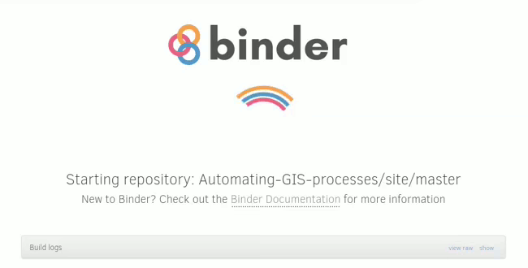

# Course environment

During this course, we use a set of tools that help make learning easier:
We will use:

1. [JupyterLab](#jupyterlab) as a development environment accessed using
   a normal web browser,
2. the [cloud computing platforms](#cloud-computing) *Binder* and *CSC
   Notebooks* to run JupyterLab in an environment in which all necessary
   libraries have already been installed,
3. [`git` and GitHub](#git-and-github) for version control and documentation,
4. [Presemo](#voting-and-polling) for interactive questions during the lectures,
5. [Discord](#discord) for communication between the University of Helsinki
   students, the course assistents, and the teachers.
6. You can clone every week lessons from the following `git` repository: [https://github.com/Automating-GIS-processes/notebooks.git](https://github.com/Automating-GIS-processes/notebooks.git)

(#jupyterlab)=
## JupyterLab: run code online I

[JupyterLab](https://jupyterlab.readthedocs.io/en/stable/getting_started/overview.html)
is an open-source web-based *integrated development interface* (IDE) for
carrying out data science. Its interface consists of several components,
including a file browser, a terminal, and a text editor, and can be extended
using various plugins.

At the core of *JupyterLab* lies the concept of *notebooks*. **Jupyter
Notebooks** (file extension `.ipynb` when used with Python) are documents in
which program code can be interleaved with rich text elements, figures, or
tables. Such a format is perfect for documenting a reproducible data science
workflow in an interactive manner.

**We use Jupyter Notebooks in JupyterLab as the default programming environment
during this course.** All of the course material can be directly opened in a
*JupyterLab* interface on [cloud computing platforms](#cloud-computing):
trying out the programming examples yourself is always just one click away.

:::{figure} ../static/images/course-info/jupyterlab-launcher_845x656px.png
:name: jupyterlab-launcher-screenshot
:alt: screenshot of the JupyterLab launcher (start screen)

Screenshot of the *JupyterLab* launcher screen, showing its different components.

:::

:::{figure} ../static/images/course-info/jupyterlab-example-notebook_845x656px.png
:name: jupyterlab-notebook-screenshot
:alt: screenshot of a notebook opened in JupyterLab

Screenshot of a notebook opened in *JupyterLab*, next to a console window and
a file manager pane.

:::

(#cloud-computing)=
## Cloud computing platforms: run code online II

Course pages that include programming examples or exercises can be launched
as [interactive notebooks](#jupyterlab) in Binder or CSC Notebooks using the
buttons in the *Rocket* menu at the top of the page.

(#launch-buttons)=
<video autoplay loop muted>
    <source src="../_static/images/course-info/launch-buttons_486x159px.webm" type="video/webm" />
    
</video>

We will use two different cloud computing platforms ([Binder](#binder) and [CSC
Notebooks](#csc-notebooks)) to access interactive versions of the lessons, and
to work on the weekly exercises. You can use them with any compyter, as long as
it has a reasonably fast internet connection and a web browser ([just please
don’t use *Internet
Explorer*](https://www.memedroid.com/memes/tag/internet+explorer)).

:::{note}

The *CSC Notebooks* platform is only accessible to students and staff at Finnish universities and research institutes.

:::

(#binder)=
### Binder

*Binder* ([mybinder.org](https://mybinder.org/) runs *Jupyter Notebooks* in a
web browser, in a customised environment. The source files are stored in a
GitHub repository; Binder fetches them on first launch. Binder does not require
the user to log in. Simply click on the [launch button](#launch-buttons) at the
top of a notebook page, and wait for Binder to load the exercise or lesson:

<video autoplay loop muted>
    <source src="../_static/images/course-info/binder-launching_650x330px.webm" type="video/webm" />
    
</video>

Once the instance is ready, you can navigate to the lesson folders and start working with existing notebooks or create a new one.

:::{warning}

**Remember to save your work!**

Binder instances are temporary, and <u>all modified files will be lost</u> after the session.

:::

(#csc-notebooks)=
### CSC Notebooks

*CSC Notebooks* is a platform offered by the Finnish [*IT Center for
Science*](https://csc.fi/en/), a publicly-owned company that supports research,
education, and culture in the country with computing infrastructure.
*CSC Notebooks* works similar to *Binder* in the sense that its primary purpose
is to run Jupyter Notebooks in a browser window. It is tailormade for
education purposes, offers more features (such as a persistent data directory),
and **is free to use for students and staff at Finnish universities**.

To start using *CSC Notebooks*:

1. Head to [notebooks.csc.fi](https://notebooks.csc.fi), and log in with your
   university credentials.
2. Then, choose ‘Join workspace’, and enter the join code
   <code class="docutils literal notranslate">
      {{csc_workspace_join_code}}
   </code>.
3. In the section ‘My workspaces’, you should now see ‘Automating GIS processes
   2, {{year}}’ with one application: click the ‘power button’ on the right side
   to start it.

:::{figure} ../static/images/course-info/csc-notebooks_2.png
:alt: Starting a *CSC Notebook*

Once you’ve joined the course’s *workspace*, you can launch its *CSC Notebook*
with one click.
:::

:::{important}
*CSC Notebooks* have seen a new, vastly improved version since last year’s
course, some features have not yet been fully implemented.

For this reason, the ‘launch button’ on top of interactive pages takes you to
the main page of *CSC Notebooks*, only, from where you still have to manually
start the course’s application.
:::

:::{caution}
Everything you save within the `my-work` directory *should* persist between
runs. However, make sure you save finished and unfinished work also in another
place, to be on the safe side, for instance, by committing and pushing it to
[your personal git repository](#git-and-github-keep-track-of-changes).
:::

(#git-and-github)=
## Git and GitHub: keep track of changes

One of the core goals of this course (besides learning how to program) is to learn
how to use [version control](https://en.wikipedia.org/wiki/Version_control)
with [`git`](https://en.wikipedia.org/wiki/Git_(software)) and how to store your
code (publicly or privately) on [GitHub ](https://github.com/).

[`git`](https://en.wikipedia.org/wiki/Git_(software)) is a version control
software (developed by a rather famous Finn: Linus Torvalds - the creator of
Linux) that is used to track and store changes in your files (e.g., software
source code) and recording the history of past changes. Git stores files in a
‘repository’, which you can simply think of as a directory tree containing all
files related to a project. Git is widely used by professionals to keep track
of their work and to collaborate with other people.

[GitHub](https://github.com/) is a web-based git repository hosting service and
social network. It is the world’s largest online storage space for collaborative
working. It is a place to share your code either openly with the entire world,
or only with your colleagues who work on the same project. GitHub provides an
easy-to-use web-interface to your files, which you can use to explore code and
documentation of many projects, for instance, the [source code of the teaching
material of this course](https://github.com/automating-gis-processes/site).

Both git and GitHub provide many more features than the ones mentioned here,
but for now we are happy to understand the basic idea of what they are.

(#voting-and-polling)=
## Voting and Polling: make yourself heard

During the lecture, there will be times when we’ll want to ask you short
questions: how easy or difficult a particular exercise felt, or what part of
last week’s content you would want to hear more about.

You can find the current poll or question at
[presemo.helsinki.fi/autogis](https://presemo.helsinki.fi/autogis)

:::{note}

The poll is active *only during the lessons*. If you access the website outside
the lecture time, chances are high that you’ll see nothing but a white page.

:::

(#discord)=
## Discord: connect with others

Throughout the course, we will use one main channel for communication: an online
application called [*Discord*](https://discord.com/) that is designed for team
collaboration. Post your questions about the lessons and exercises there, answer
other peoples’ questions (and gain academic karma), and engage in discussions
about anything else concerning the course.

All enrolled students have received an invitation to the course’s Discord
workspace, let us know if you haven’t.

:::{figure} ../static/images/course-info/discord_logo.png
:alt: Discord Logo

:::

% -----
%
% You should now have a basic idea about the different tools we will use in this
% course, and how to use them. Don’t worry: you don’t need to understand
% everything to its full extend at this point, it will become much clearer once
% we start using the course’s environment.
