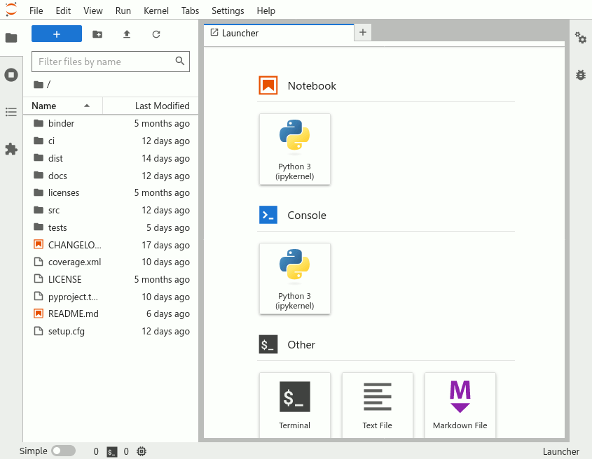
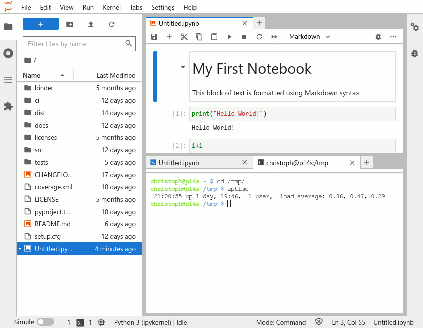

# Course environment

During this course, we use a set of tools that help make learning easier:
We will use:

1. [JupyterLab](#jupyterlab) as a development environment accessed using
   a normal web browser,
2. the [cloud computing platforms](#cloud-computing) *Binder* and *CSC
   Notebooks* to run JupyterLab in an environment in which all necessary
   libraries have already been installed,
3. [`git` and GitHub](#git-and-github) for version control and documentation,
4. [Presemo](#voting-and-polling) for interactive questions during the lectures,
   and
5. [Slack](#slack) for communication between the University of Helsinki
   students, the course assistents, and the teachers.

(#jupyterlab)=
# JupyterLab: run code online I

[JupyterLab](https://jupyterlab.readthedocs.io/en/stable/getting_started/overview.html)
is an open-source web-based *integrated development interface* (IDE) for
carrying out data science. Its interface consists of several components,
including a file browser, a terminal, and a text editor, and can be extended
using various plugins.

At the core of *JupyterLab* lies the concept of *notebooks*. **Jupyter
Notebooks** (file extension `.ipynb` when used with Python) are documents in
which program code can be interleaved with rich text elements, figures, or
tables. Such a format is perfect for documenting a reproducible data science
workflow in an interactive manner.

**We use Jupyter Notebooks in JupyterLab as the default programming environment
during this course.** All of the course material can be directly opened in a
*JupyterLab* interface on [cloud computing platforms](#cloud-computing): 
trying out the programming examples yourself is always just one click away.

:::{figure-md} jupyterlab-launcher-screenshot

Screenshot of the *JupyterLab* launcher screen, showing its different components.

:::

:::{figure-md} jupyterlab-notebook-screenshot

Screenshot of a notebook opened in *JupyterLab*, next to a console window and
a file manager pane.

:::

(#cloud-computing)=
## Cloud computing platforms: run code online II

Course pages that include programming examples or exercises can be launched
as interactive notebooks in Binder or CSC Notebooks using the buttons in the
*Rocket* menu at the top of the page.

(#launch-buttons)=
<video autoplay loop muted>
    <source src="../_static/images/course-info/launch-buttons_486x159px.webm" type="video/webm" />
    
</video>

We will use two different cloud computing platforms ([Binder](#binder) and [CSC
Notebooks](#csc-notebooks)) to access interactive versions of the lessons, and
to work on the weekly exercises. You can nuse them with any compyter, as long as
it has a reasonably fast internet connection and a web browser ([just please
don’t use *Internet
Explorer*](https://www.memedroid.com/memes/tag/internet+explorer)).

:::{note}

The *CSC Notebooks* platform is only accessible to students and staff at Finnish universities and research institutes.

:::

(#binder)=
### Binder

*Binder* ([mybinder.org](https://mybinder.org/) runs *Jupyter Notebooks* in a
web browser, in a customised environment. The source files are stored in a
GitHub repository; Binder fetches them on first launch. Binder does not require
the user to log in, simple click on the [launch button](#launch-buttons) at the
top of a notebook page, and wait for Binder to load the exercise or lesson:

<video autoplay loop muted>
    <source src="../_static/images/course-info/binder-launching_650x330px.webm" type="video/webm" />
    
</video>

Once the instance is ready, you can navigate to the lesson folders and start working with existing notebooks or create a new one.

:::{warning}

**Remember to save your work!**

Binder instances are temporary, and <u>all modified files will be lost</u> after the session.

:::

(#csc-notebooks)=
### CSC Notebooks

adsfasdf

(#git-and-github)=
## `git` and GitHub: keep track of changes

asdf

(#voting-and-polling)=
## Voting and Polling: make yourself heard

asdf

(#slack)=
## Slack: connect with others

asdf
