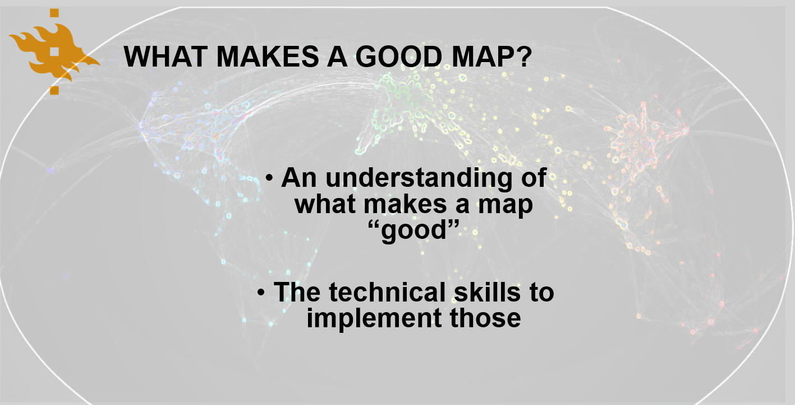

.. CartoGIS documentation master file, created by
   sphinx-quickstart on Thu Dec 14 06:24:35 2023.
   You can adapt this file completely to your liking, but it should at least
   contain the root `toctree` directive.

Cartographic Visualization in GIS 2024
====================================

Welcome to Cartographic Visualization in GIS (GEOG-349). Through interactive lessons and hands-on exercises, this course will guide you through the fascinating world of cartography and map making. It combines the conceptual, historical, artistic, and theoretical aspects of cartography with modern technology, giving you a comprehensive and advanced toolkit for map making.

This course is developed and delivered by the `Digital Geography Lab <https://www.helsinki.fi/en/researchgroups/digital-geography-lab>`__ at the Department of Geosciences and Geography, `University of Helsinki <https://www.helsinki.fi/en>`__. We love open science, so we’re sharing this course openly for everyone’s learning.

.. admonition:: Open Access

      Course material and videos are **open for everyone**. The aim of this course is to share the knowledge and help people to get started with their journey towards spatial data visualization and cartography more efficiently and in a better reproducible manner. Feel free to share this website with anyone interested, and use the provided material in your own teaching.

      Read more about the license and terms of usage `here <course-info/license.html>`__.

After the course, the student is able to

- Understand the history of cartographic theory and how it links to the present day map making.
- Apply the theoretical knowledge in designing appealing and effective visual representations.
- Use the state of the art approaches for cartographic visualization to produce maps and other visualisations for printed and online media.

.. admonition:: Interactive content

      The Python tutorials in this course can be turned into an interactive programming session in the browser. You’ll find buttons for activating the python environment using Binder at the top of each programming lesson. Students at Finnish higher education institutions are encouraged to use `CSC’s Notebooks <https://notebooks.csc.fi/>`__.

Course format
-------------

The course is organized in a lecture + exercise session format. The exercise sessions are hands-on and allow students to practice and develop their skills in cartographic visualization using GIS and to receive help from course assistants. Additional readings will be provided in the lectures. The exercise sessions are divided between a more software-based or Python-based approach to cartography, and the students can choose their path at the beginning of the course.

.. admonition:: Do I need to know programming?

   In this course, you can choose either the software-based or Python-based approach to Cartography. In the software-based approach, we will work with `QGIS <https://www.qgis.org/en/site/>`_. While knowledge of Python programming can be beneficial and is needed on a basic level, fluency in it is not required. However, those who choose to take the Python-based approach are expected to already know the Python programming language and be familiar with GIS and data analysis in Python (particularly working with Pandas and Geopandas Library). Familiarity with creating plots in Python (for example, using Matplotlib) is welcome but not absolutely needed as these will be briefly covered during the course. If you take the Python-based approach, you are advised to have previously completed the `Geo-Python <https://geo-python-site.readthedocs.io/en/latest/>`_ and `AutoGIS <https://autogis-site.readthedocs.io/en/latest/>`_ courses.

.. admonition:: Previous knowledge of GIS and Cartography

      This is an advanced-level course. A previous knolwedge of GIS concepts and cartographic principles are required.

In addition to weekly exercises, students will submit a portfolio at the end of the course. The portfolio includes a short description of each exercise and a project work applying the knowledge gained during the course.

Course topics by week
---------------------

This is a four-week intensive course that will familiarize the students with the art and science of cartographic visualization. The students will learn about the cartographic theories and how to implement them in a GIS environment, to create appealing and effective communication of their findings. Regardless of which path you choose (software or Python), you will achieve the same outcomes and learn to create more or less similar maps using different approaches. At the University of Helsinki, the course runs for four weeks during the intensive teaching period, starting on Monday, 6 May 2024.

During the teaching period, this web page is updated each week before the lecture. Please note that there can be small changes to the program and topics for each week. 

+------+------------------------------------------------------------+------------------------------------------------------+----------------------------------------------+
| Week | Lecture theme                                              | Tutorial                                             | Discussion                                   |
+======+============================================================+======================================================+==============================================+
| 1    | Introduction, cartography as an art                        | Map making 101: colors, layout                       | Cartography as an art, projections           |
+------+------------------------------------------------------------+------------------------------------------------------+----------------------------------------------+
| 2    | The digital turn and geospatial data, color theory         | Static maps, PPGIS                                   | Colors in maps, visual hierarchy             |
+------+------------------------------------------------------------+------------------------------------------------------+----------------------------------------------+
| 3    | Cartographic Story Telling and Critical cartography Theory | Visualizing big geospatial data,                     | Story telling with geospatial data           |
|      | (Franz-Benjamin Mocnik)                                    | Non-cartographic visualization                       |                                              |
+------+------------------------------------------------------------+------------------------------------------------------+----------------------------------------------+
| 4    | Map media, tools, and future directions                    | Interactive visualization, mapping time, other tools | AI and future of cartography (portfolios)    |
+------+------------------------------------------------------------+------------------------------------------------------+----------------------------------------------+

.. toctree::
   :maxdepth: 2
   :caption: Course information

   course-info/general-info.ipynb
   course-info/course-env.ipynb
   course-info/grading.ipynb
   course-info/learning-goal.rst
   course-info/install-python.ipynb
   course-info/python-gis-env.ipynb
   course-info/ai-tools.ipynb
   course-info/resources.ipynb
   course-info/license.ipynb

.. toctree::
   :maxdepth: 2
   :caption: Lesson 1

   lectures/Lecture-1.ipynb
   notebooks/week1/projections.ipynb
   notebooks/week1/PythonVSsoftware.ipynb
 

Indices and tables
==================

* :ref:`genindex`
* :ref:`modindex`
* :ref:`search`
