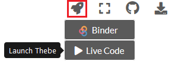
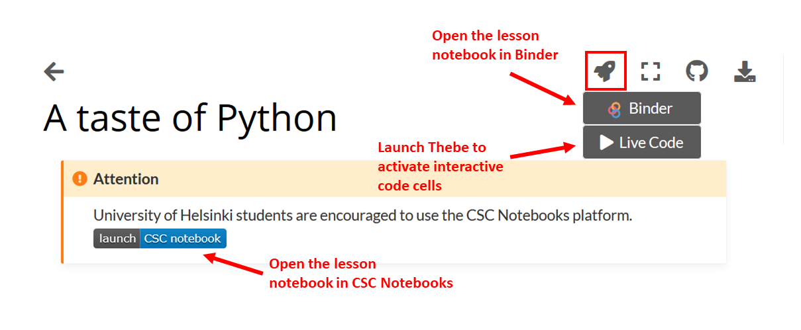

Course environment
==================

During this course, we will use different tools and applications for programming and communications.

CSC Notebooks
~~~~~~~~~~~~~~~

Notebooks by CSC (https://notebooks.csc.fi) is a computing environment hosted by the Finnish IT Center for Science (CSC). Similarly as in Binder, CSC notebooks are used for running Jupyter Notebooks in a customized environment.
CSC Notebooks is available only for students who are affiliated with Finnish universities and research institutes (via the HAKA user authentication).

.. note:: **When using the CSC Notebooks for the first time, you need to join the group created for this course:**

    1. Log in at https://notebooks-beta.rahtiapp.fi/welcome
    2. Click ‘Join workspace’ in the top bar and insert code provided in the HackMD.
    3. Now you should see ‘Python GIS course’ in the list on the dashboard.
    4. Click Start session under ‘Python GIS course’
    5. Wait for a moment, JupyterLab will open.

**Remember to save your work!**

Interactive code cells
-----------------------

All pages with code cells can be turned into an interactive mode where you can run the code directly in the browser!

.. note::

    The interactive code cells are a new feature in the course materials. This feature is still a bit experimental!
    Remember that you can always open up the materials in Binder or CSC Notebooks and run the code in there.

JupyterLab
------------
`JupyerLab <https://jupyterlab.readthedocs.io/en/stable/getting_started/overview.html>`__ is an open-source web-based user interface for doing data science.
The JupyterLab interface consists of different components such as a file browser, terminal, image viewer, console, text editor, etc.

**Jupyter Notebooks** (filename extension ``.ipynb``) are documents inside the JupyterLab environment which contain computer code, and rich text elements (figures, links, etc.).
Jupyter Notebooks are perfect for documenting a data science workflow in an interactive format.

**We use JupyterLab/Jupyter Notebooks as the default programming environment during this course.**
All of the course materials are available in a JupyterLab setting via `cloud computing environments`_ (Binder or CSC Notebooks).

.. figure:: img/Binder_launcher.png
   :alt: Binder Jupyter Notebook
   :width: 700px

   Basic view of JupyterLab

.. figure:: img/JupyterLab.png
   :alt: A Jupyter Notebook open in JupyterLab
   :width: 700px

   A Jupyter Notebook open in JupyterLab

Cloud computing environments
--------------------------------

We will use cloud-based computing environments (Binder or CSC Notebooks) to access interactive online version of the lessons
and to work on the weekly exercises. You can use the cloud computing environments with any computer as long as it has a reasonably fast internet connection and a web browser (just don't use Internet Explorer).

Please note that the cloud computing environments are **temporary**. Always remember to push your changes to GitHub (and / or download a local copy).

   Different options for making the lesson interactive

Each interactive lesson and exercise will have a launch button for both Binder and CSC Notebook.
The CSC notebooks environment is only accessible to students from Finnish universities and research institutes.

Using your own computer
--------------------------------
We recommend everyone to use the available `cloud computing environments`_ during this course.
In case you want to work on your own computer, you need to `install Python and relevant packages on your own computer <installing-miniconda.html>`_.

Binder
~~~~~~~

Binder (https://mybinder.org/) runs Jupyter Notebooks in your web browser in a customized environment. The original files (notebooks) are hosted on GitHub.
Binder does not require the user to log in, you can just click on the link in the lesson / exercise and start working.

.. figure:: img/Binder_loading.png
   :alt: Binder loading
   :width: 700px

   Binder takes a few moments to load

Once the instance is ready, you can navigate to the lesson folders and start working with existing notebooks or create a new one.

**Remember to save your work! The Binder instance is temporary, and all your files will be lost after the session.**