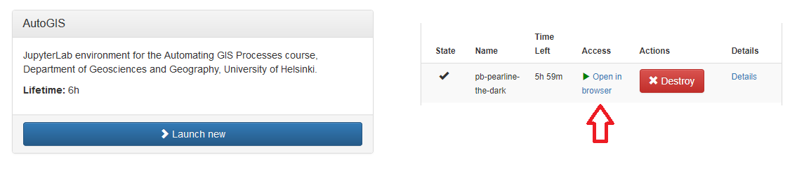

Course environment
==================

In this course we will actively use a course environment that consist of modern tools and applications for:

1. Doing the actual programming with `Jupyter Notebooks and JupyterLab`_ using
    - `your own computer <#using your own computer>`_ or
    - a `cloud computing environment <#cloud computing environments>`_
2. Sharing and saving your work online with version control (`Git + GitHub`_)
3. Communicating online (`Using Slack`_)
4. `Voting / polling during the lectures <#voting-and-polling>`_

Jupyter Notebooks and JupyterLab
--------------------------------
Jupyter Notebooks and JupyerLab belong to `Project Jupyter <http://jupyter.org/>`__, an open-source project which provides tools for data science. In this course we will use Jupyter Notebooks and JupyterLab as the default programming environment.

**Jupyter Notebooks** are documents which contain both computer code, text and other elements (such as figures, links etc.).
Jupyter Notebooks are perfect for documenting your data science workflow in an interactive format.

**JupyterLab** is an interface for using Jupyter Notebooks. Jupyter lab consists of different components such as a file browser, terminal, image viewer, console, text editor, etc.
You can either use JupyterLab on your own computer, or via the available cloud computing resources (Binder or CSC Notebooks).

.. figure:: img/JupyterLab.png
   :alt: A Jupyter Notebook open in Jupyter Lab
   :width: 550px

   A Jupyter Notebook open in Jupyter Lab

Using your own computer
-------------------------
We recommend that students would use their own computers during the lectures.
You can either `install python <https://geo-python.github.io/2018/course-info/installing-anacondas.html>`_ on your own machine, or use the available `cloud computing environments`_.
During the practical exercise sessions you can either use your own computer, or the computers available in the classroom.

Cloud computing environments
----------------------------

During this course we encourage you use a cloud-based computing environment (Binder or CSC Notebooks) to access interactive online version of the lessons
and to develop your own code for the course exercises. You can use the cloud computing environments with any computer (as long as it has a reasonably fast internet connection and a web browser).

Please note that the cloud computing environments are **temporary**, always remember to download your own work (and / or push it to github).

.. figure:: img/LaunchButtons2.png
   :alt: Launch buttons on the Lesson 1: Geometric objects - Spatial data model
   :width: 550px

   Launch buttons on the Lesson 1: Geometric objects - Spatial data model

Each interactive lesson and exercise will have a launch button for both Binder and CSC Notebook.
Both of the environments should work in a similar manner, but we have two options available in case one of the services is not working properly.

Binder and CSC Notebooks provide a **temporary** JupyterLab environment (tailored for this course).
The difference to working with a local installation is that the computer that runs our commands is located in the 'cloud'.

Binder
~~~~~~~~~~~~~~~~~~~

Binder (https://mybinder.org/) runs custom-made Jupyter Notebooks in your web browser. The original files (notebooks) are hosted on GitHub.
Binder does not require the user to log in, you can just click on the link in the lesson / exercise and start working. Our course webpages contain two different launch links for Binder:

- *full binder* contains lesson notebooks including all the necessary code
- *student binder* contains lesson notebooks without pre-filled code

.. figure:: img/Binder_loading.png
   :alt: Binder loading
   :width: 550px

   Binder takes a few moments to load

.. figure:: img/Binder_launcher.png
   :alt: Binder Jupyter Notebook
   :width: 550px

   JupyterLab ready to be used in Binder

Once the instance is ready, you can navigate to the lesson folders and start working with existing notebooks or create a new one.

**Remember to save your work! The instance is temporary.**

CSC Notebooks
~~~~~~~~~~~~~~~~~~~

Notebooks by CSC (https://notebooks.csc.fi) is a computing environment hosted by the Finnish IT Center for Science (CSC).
This service is available only for students who are affiliated with Finnish universities and research institutes (via the HAKA user authentication).

**When using the CSC Notebooks for the first time, you need to join the group created for this course:**

1. Log in
2. Go to Account
2. Join Group `Geo-Python` using the joining code: geo-python-tadl4

After joining the group, you should be able to view an environment called `JupyterLab` on the Dashboard.

**Repeat these steps every time when starting to work on a programming task using the CSC Notebooks:**

1. Click on the launch CSC Notebook -button on the course webpage (or enter via notebooks.csc.fi) and log in.
2. Click `Launch new` under the JupyterLab - Environment on the Dashboard
3. Click "open in browser" once the instance is ready

**Remember to save your work! The instance is temporary.**

Git + GitHub
------------

One of the core components of this course (besides learning programming)
is to learn how to use `version control <https://en.wikipedia.org/wiki/Version_control>`__ with
`Git <https://en.wikipedia.org/wiki/Git_(software)>`__ and storing your
the codes (privately) in `GitHub <https://github.com/>`__.

`Git <https://en.wikipedia.org/wiki/Git_(software)>`__ is a version
control software (developped by a rather famous Finn named Linus
Torvalds - he also created Linux!) that is used to track and store
changes in your files (often source code for programs) without losing
the history of past changes. Files in Git are stored in a repository,
which you can simply think of as a directory containing files (or other
directories) related to a single 'project'. Git is widely used by
professionals to keep track of what they’ve done and to collaborate with
other people.

`GitHub <https://github.com/>`__ is a web based Git repository hosting
service and social network. It is the largest online storage space of
collaborative works that exists in the world. It is a place where you
can share your code openly to the entire world or alternatively only to
your collaborators working on the same project. GitHub provides a nice
web-interface to your files that is easy to use. It is a nice way for
exploring the codes and documentation or e.g., teaching materials such
as those in our course.

Both Git and GitHub provide many more features than the ones mentioned
here, but for now we are happy to understand the basic idea of what they
are.

Using Slack
-------------

During the course we will use actively an application called `Slack <http://slack.com>`__ for discussion and
questions about the lessons and exercises. All enrolled students have received an invite link to the `geopython2018` workspace at the start of the course.
:doc:`Read more about Slack  <slack-usage>`.

Voting and polling
------------------

During the lectures we will ask you questions by using an easy-to-use polling-system and show you the results in real-time.
You can access the polling system of our course from `<https://geo-python.github.io/poll>`__

.. note::

    The polling system is active only **during** the lessons. If you access the website outside the lecture times, you
    will most probably see only a white page without any content.

Page summary
------------

Now you should have (at least) a basic idea about the different
components of our course environment and what they mean. You don't need
to understand everything fully at this point as they will become clearer
when we start using the course environment.