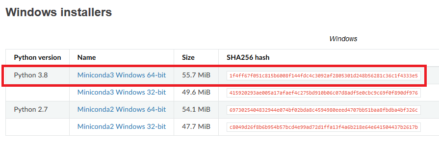
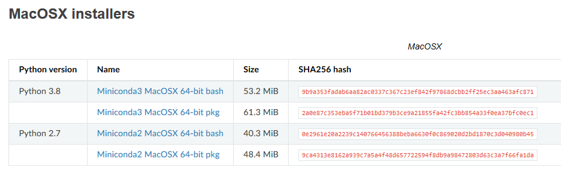
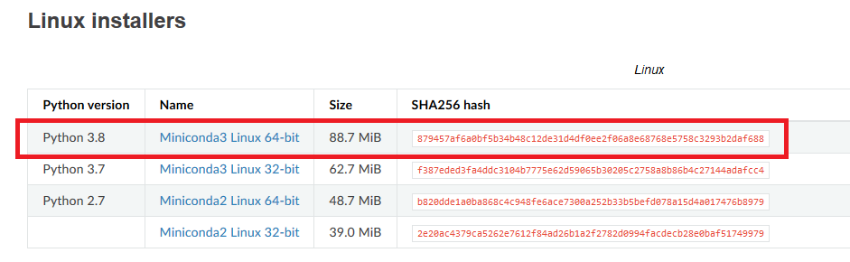

Installing Python
=================

**It is possible to do programming with Python on your own computer**, but first you need to install Python. The purpose of this page is to help you to
install Python and different Python packages into your own computer. Even though it is possible to install Python from their `homepage <https://www.python.org/>`_,
**we highly recommend using** `Miniconda <https://docs.conda.io/en/latest/miniconda.html>`_ for installing Python.
Miniconda comes with Python and a small number of useful packages. Additional packages can be installed using the package management system `conda <https://docs.conda.io/en/latest/>`__.

Miniconda is a light-weight version of `Anaconda <https://www.anaconda.com/>`_ which is an open source distribution of the Python and R programming
languages for large-scale data processing, predictive analytics, and scientific computing, that aims to simplify package management and deployment. In short,
it makes life much easier when installing new tools to your Python. Full anaconda installation comes with all packages needed in the Geo-Python course (and many more!),
but Miniconda allows us to save some disk space and avoid package conflicts (important for those installing GIS-packages!).

In case you already have Anaconda installed on your computer, you can continue using that during the Geo-Python course without a problem.
**If you are new to Python and have not yet installed anything, we recommend you to start by** `installing Miniconda on your computer <https://docs.conda.io/en/latest/miniconda.html>`__.

.. admonition:: Do I need to install anything?

    Please note that you can also complete the Geo-Python course without installing anything on your own computer!
    Each lesson contains a launch button for running the code **interactively in the browser**.

Install Miniconda
-------------------

You can find the latest version of Miniconda for different operating systems in the `Miniconda dowload page <https://docs.conda.io/en/latest/miniconda.html>`__.
Tips and tricks for Windows, macOS and Linux users below.

Windows
~~~~~~~~

Visit the `Miniconda download page <https://docs.conda.io/en/latest/miniconda.html#windows-installers>`__ and download the latest
**Miniconda3 Windows 64-bit** installer for Windows.

Install Miniconda to your computer by double clicking the installer and install it into a directory you want (needs admin rights).
Install it to **all users** and use default settings.

After the installation is completed, test that the package manager ``conda`` works by
`opening a command prompt as a admin user <http://www.howtogeek.com/194041/how-to-open-the-command-prompt-as-administrator-in-windows-8.1/>`_
and running command ``conda --version``. If the command returns a version number of conda (e.g. ``conda 4.5.9``) everything is working correctly.

.. admonition:: Winows admin rights for UH computers

    Windows users with a **computer administered by the University of Helsinki**: If you don't have **administrator rights** on your
    computer, you might want to apply for an admin account. Read more about administrator rights and
    software installations in `here <https://helpdesk.it.helsinki.fi/en/instructions/computer-and-printing/workstation-administrator-rights>`__.

macOS
~~~~~~~~
Visit the `Miniconda download page <https://docs.conda.io/en/latest/miniconda.html#macosx-installers>`__ and download the latest
Python 3.8 installer for macOSX.

Linux
~~~~~~~~
Visit the `Miniconda download page <https://docs.conda.io/en/latest/miniconda.html#linux-installers>`__ and download the latest
Python 3.8 installer for Linux.

**Install Miniconda 3 and add it to system path:**

.. code-block::

    # Download and install Anaconda
    sudo wget https://repo.anaconda.com/miniconda/Miniconda3-latest-Linux-x86_64.sh
    sudo bash Miniconda3-latest-Linux-x86_64.sh

    # Add Anaconda installation permanently to PATH variable
    nano ~/.bashrc

    # Add following line at the end of the file and save (EDIT ACCORDING YOUR INSTALLATION PATH)
    export PATH=$PATH:/PATH_TO_MINICONDA/miniconda3/bin:/PATH_TO_MINICONDA/miniconda3/lib/python3.8/site-packages

Installing packages using Conda
---------------------------------

Conda has an excellent `online user guide <https://docs.conda.io/projects/conda/en/latest/index.html>`__ which covers most of the basic things,
such as installing new packages.

Conda install
~~~~~~~~~~~~~~~

You can install new packages using the `conda install <https://docs.conda.io/projects/conda/en/latest/commands/install.html>`__
command. The basic syntax for installing packages is ``conda install package-name``.
In addition, we also want to specify the **conda channel** from where the package is downloaded using the parameter `-c`.

**Installing Pandas package from the conda-forge channel:**

.. code-block::

    conda install -c conda-forge pandas

Once you run this command, you will see also other packages getting installed and/or updated as conda checks for dependencies of the installed package.
Read more about package installations in the `conda documentation <https://docs.conda.io/projects/conda/en/latest/user-guide/tasks/manage-pkgs.html#installing-packages>`__
It's a good idea to search for installation instructions for each package online.

You can **install other useful packages in a similar way:**

.. code-block::

    conda install -c conda-forge matplotlib
    conda install -c conda-forge bokeh
    conda install -c conda-forge geopandas

.. admonition:: Conda channels

    `Conda channels <https://docs.conda.io/projects/conda/en/latest/user-guide/concepts/channels.html>`__ are remote locations where packages are stored.
    During this course (and in general when installing packages for scientific computing and GIS analysis) we download most packages from the `conda-forge <https://conda-forge.org/#about>`__ channel.

.. admonition:: Conflicting packages

    A good rule of thumb is to **always install packages from the same channel** (for this course, we prefer the `conda-forge` channel).
    In case you encounter an error message when installing new packages, you might want to first check the versions and channels of existing
    packages using the `conda list` command before trying again.

Installing JupyterLab
~~~~~~~~~~~~~~~~~~~~~~~

We use `JupyerLab <https://jupyterlab.readthedocs.io/en/stable/getting_started/overview.html>`__ as the main developing environment during this course.
JupyterLab can be installed like any other packages using the conda install command.

For other options and more information, take a look at the `JupyterLab installation instructions <https://jupyterlab.readthedocs.io/en/stable/getting_started/installation.html>`__.

**Install JupyterLab from the conda-forge channel:**

.. code-block::

    conda install -c conda-forge jupyterlab

After installation is completed, you can start a JupyterLab instance by running this command (notice the space between the words!):

.. code-block::

    jupyter lab

After running the command, JupyterLab should open up automatically in a browser window.

Git extension for JupyterLab
~~~~~~~~~~~~~~~~~~~~~~~~~~~~~~

After you have installed JupyterLab, you can also add the JupyterLab Git extension to your environment:

.. code-block::

    conda install -c conda-forge jupyterlab-git

