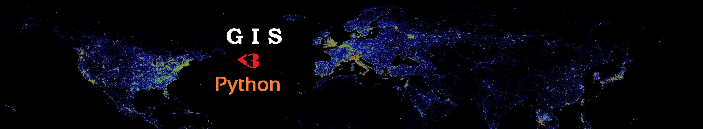

Welcome to Automating GIS processes course!
===========================================

.. slide:: 
    https://docs.google.com/presentation/d/1FOjYjUBqqfKh1JXdY5dOlkIy0kvAJMHHqSORSSKP9Ec

**Automating GIS processes** -course teaches you how to do different GIS-related tasks in Python programming language. Each lesson is a tutorial with specific topic(s) where the aim is to learn
how to solve common GIS-related problems and tasks using Python tools. In the lessons we use only publicly available data which can be used and downloaded by anyone anywhere. In this course,
we assume that you know the basics of Python programming. If Python is not familiar to you, we recommend to start with our earlier course that focuses on learning the basics of Python
from `geo-python.github.io <https://geo-python.github.io>`_.

Course format
-------------

The majority of this course will be spent in front of a computer learning to program in the Python language and working on exercises.
During Teaching Period I, the Automating GIS-processes and `Introduction to Quantitative Geology <https://github.com/Intro-Quantitative-Geology/Course-information>`_ courses met together and focused on
`learning to program in Python <https://geo-python.github.io>`_. Previously, both these courses lacked sufficient time for students to properly learn the basic concepts of programming in Python.

The computer exercises will focus on developing basic programming skills using the Python language and applying those skills to various GIS related problems.
Typical exercises will involve a brief introduction followed by topical computer-based tasks. At the end of the exercises, you may be asked to submit answers
to relevant questions, some related plots, and/or Python codes you have written or used. You are encouraged to discuss and work together with other students
on the laboratory exercises, however the laboratory summary write-ups that you submit must be completed individually and must clearly reflect your own work.

.. admonition:: Open Access!

    The course is **open for everyone**. The aim of this course is to share the knowledge and help people to get started with their journey for doing GIS more efficiently and in a reproducible manner
    using Python programming.

.. admonition:: Step by step instructions with cloud computing!

    The materials are written in a way that you can follow them step by step exactly as they are written, as long as you use the cloud computing resources that
    we provide for you (unfortunately **for Uni. Helsinki people** only). Read more about our cloud computing environment from `here <https://github.com/Python-for-geo-people/Lesson-1-Course-Environment/blob/master/Background/course-environment-components.md>`_.
    If you work from your own computer, **you need to adjust the file paths to the data** accordingly.

.. admonition:: For teachers

    If you would like to use these materials for your own teaching or develop them further, we highly support that.
    Please read more about how to do it from `here <License-terms.html>`_.

Course topics by week
---------------------
See earlier materials from Period I `here <https://geo-python.github.io>`_.

The materials are divided into weekly sections that are published at these pages every Monday morning. Lessons are held with following schedule:

 * 30.10 - Lesson 1: GIS in Python; Spatial Data Model, Geometric Objects, Shapely
 * 06.11 - Lesson 2: Working with (Geo)DataFrames
 * 13.11 - Lesson 3: Geocoding and spatial queries
 * 20.11 - Lesson 4: Geometric operations, reclassifying data
 * 27.11 - Lesson 5: Visualization, static and interactive maps
 * 07.12 - Lesson 6: Python programming in Quantum GIS
 * 11.12 - Lesson 7: Network analysis and routing in Python

Contents
--------
*Lesson content, readings and due dates are subject to change*

.. toctree::
   :maxdepth: 2
   :caption: Course information

   course-info/course-info
   course-info/Installing_Anacondas_GIS
   course-info/License-terms

.. toctree::
   :maxdepth: 2
   :caption: Lesson 1

   lessons/L1/Intro-Python-GIS
   lessons/L1/overview
   lessons/L1/lecture
   lessons/L1/Geometric-Objects
   lessons/L1/ex-1
   lessons/L1/exercise-1-hints

