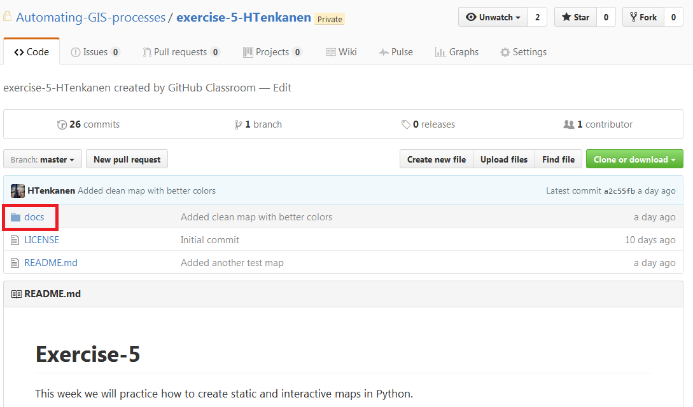
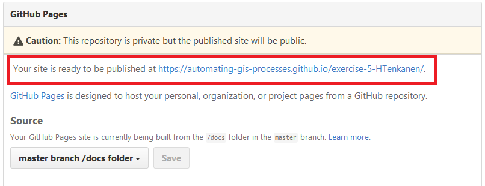

Sharing interactive plots on GitHub
===================================

Interactive plots are really nice but of course it would be nice to be able to show them to your friend also, wouldn't it?

Luckily, there is a really easy way of doing this using GitHub and their specific feature called `GitHub Pages <https://pages.github.com/>`_ which you can easily combine into your
GitHub repositories.

Here is a short video demonstrating what all you can do with GitHub pages:

.. raw:: html

  <iframe width="560" height="315" src="https://www.youtube.com/embed/2MsN8gpT6jY" frameborder="0" allowfullscreen></iframe>

|

How the repository should be organized?
---------------------------------------

For the purpose of sharing our maps on GitHub, we will use the Exercise 5 repository where we will upload our maps. You can follow these instructions on GitHub after accepting the Github classroom invitation link for :doc:`Exercise 5 <exercise-5>`.

When you want to publish something on GitHub Pages, it is generally a good idea to store your html files (such as the ones we made earlier) under a single folder called ``docs``
which should be located on the root of your repository. The Exercise 5 repository already contains such a folder:
the folder ``docs``:

|

Thus, **all your html maps and plots should be stored there!** Why? Because we can set up GitHub to search our html files from there by default and storing those files under a separate folder
keeps things nicely organized.

What is currently located there are following files:

.. image:: img/docs-contents.PNG

|

Thus, there is already a single map that I have made called *test_map.html*, a html file called *index.html* and the most important file for us called ``index.md``.

Let's see how does the ``index.md`` file look like (here is a `link <https://github.com/AutoGIS-2021/Exercise-5/blob/master/docs/index.md>`_ to the actual page on our public repository):

.. image:: img/index-md.PNG
    :scale: 80 %

|

Okey, so we can see that this is a familiar looking page with some Markdown text and links. What is the purpose of this page is to serve as an **entrance page** for you interactive plots.
Thus as the page say, you should add links to your maps that are published from your personal Exercise 5 located at ``https://autogis-2020.github.io/exercise-5-YourUserName/`` (for example, the address for vuokko's exercise 5 submission is ``https://autogis-2020.github.io/exercise-5-VuokkoH/``).

**Okey but how does that work, how do I get a page with such an address?**

The magic here is something where **GitHub Pages** comes into a picture. That address is going to be created when I
**activate the GitHub Pages** for my Exercise 5 repository.

Let's see how that can be done. Luckily **it's easy**.

Activating GitHub Pages
-----------------------

First, you should navigate into the **Settings** of your Exercise 5 repository by clicking following tab on the right side of the upper panel:

.. image:: img/github-settings.PNG
    :scale: 80 %

|

In there you can adjust different Setting regarding your repository but what we are interested in is a section called **GitHub Pages** which can be found when you scroll down a little bit.
It looks like following:

.. image:: img/Github-pages-settings.PNG
    :scale: 80 %

|

From there you should choose the **source for your pages**, i.e. the place where those html files are searched from. You should choose the ``master branch /docs folder`` which is the location
that we just visited earlier and where we should store our html files:

.. image:: img/github-pages-docs-folder.PNG
    :scale: 80 %

|

Finally, you should press the **Save** button and after that GitHub Pages are activated for you!

|

Accessing GitHub Pages
----------------------

Now if I press the link that is shown above I will arrive into a following page:

.. image:: img/index_HTML.PNG
    :scale: 80 %

|

This page is showing the contents of the ``index.html`` file that was also located in our ``docs`` folder.

Note, that in this exercise we won't be practicing how to write HTML code and therefore **we will use the index.md file under the docs-folder to maintain the links**, as you already know how to write Markdown.

We can now **navigate to whatever file that is located under that folder.** Thus, we can for example access the test_map.html by typing:
`https://autogis-2020.github.io/exercise-5-VuokkoH/test_map.html <https://autogis-2020.github.io/exercise-5-VuokkoH/test_map.html>`_

**Ahaa!** So this means that if you upload e.g. an interactive map that you have prepared into that folder you are able to access it also from anywhere. And also share it with your
friends! You just need to change the name of the html file according the filename that you have uploaded. So this is how we can easily share interactive maps on GitHub for anyone.

.. note::

    Notice that even though your personal Exercise 5 repository in GitHub is private and no-one else can access it, **all the files that you store under the docs folder CAN BE ACCESSED by anyone**.
    So keep this in mind when using GitHub Pages.

.. hint::

    Notice that now you can also do your personal GitHub Pages where you can store and share all sorts of cool stuff that you have created yourself! You just need to
    `create your own repository <https://help.github.com/articles/create-a-repo/>`_ and follow exactly the same steps that were mentioned here.
