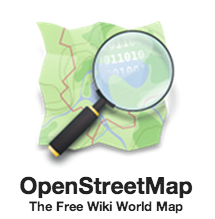

Retrieving OpenStreetMap data
=============================

What is OpenStreetMap?
----------------------

OpenStreetMap (OSM) is a global collaborative (crowd-sourced) dataset and project that aims at creating a free editable map of the world
containing a lot of information about our environment.
It contains data for example about streets, buildings, different services, and landuse to mention a few.

OSM has a large userbase with more than 4 million users that contribute actively on OSM by updating the OSM database
with 3 million changesets per day. In total OSM contains more than 4 billion nodes that form the basis of the digitally
mapped world that OSM provides (`stats from November 2017 <http://wiki.openstreetmap.org/wiki/Stats>`__.

OpenStreetMap is used not only for integrating the **OSM maps** as background maps to visualizations or online maps,
but also for many other purposes such as **routing**, **geocoding**, **education**, and **research**. OSM is also widely used for
humanitarian response e.g. in crisis areas (e.g. after natural disasters) and for fostering economic development
(see more from `Humanitarian OpenStreetMap Team (HOTOSM) website <https://www.hotosm.org/>`__.

Osmnx
-----

This week we will explore a new and exciting Python module called `osmnx <https://github.com/gboeing/osmnx>`__
that can be used to retrieve, construct, analyze, and visualize street networks from OpenStreetMap.
In short it offers really handy functions to download data from OpenStreet map, analyze the properties of the OSM street networks,
and conduct network routing based on walking, cycling or driving.

There is also a scientific article available describing the package:

    - Boeing, G. 2017. `"OSMnx: New Methods for Acquiring, Constructing, Analyzing, and Visualizing Complex Street Networks." <https://www.researchgate.net/publication/309738462_OSMnx_New_Methods_for_Acquiring_Constructing_Analyzing_and_Visualizing_Complex_Street_Networks>`__ Computers, Environment and Urban Systems 65, 126-139. doi:10.1016/j.compenvurbsys.2017.05.004

Download and visualize OpenStreetMap data with osmnx
----------------------------------------------------

As said, one the most useful features that osmnx provides is an easy-to-use way of retrieving `OpenStreetMap <http://www.openstreetmap.org/>`__ data
(using `OverPass API <http://wiki.openstreetmap.org/wiki/Overpass_API>`__ ).

Let's see how we can download and visualize street network data from a district of Kamppi in Helsinki, Finland.
Osmnx makes it really easy to do that as it allows you to specify an address to retrieve the OpenStreetMap data around that area.
In fact, osmnx uses the same Nominatim Geocoding API to achieve this which we tested during the Lesson 2.

- Let's retrieve OpenStreetMap (OSM) data by specifying ``"Kamppi, Helsinki, Finland"`` as the address where the data should be downloaded.

.. ipython:: python

    import osmnx as ox
    import matplotlib.pyplot as plt
    place_name = "Kamppi, Helsinki, Finland"
    graph = ox.graph_from_place(place_name)
    type(graph)

Okey, as we can see the data that we retrieved is a special data object called ``networkx.classes.multidigraph.MultiDiGraph``. A DiGraph is a data type that stores nodes and edges with optional data, or attributes.
What we can see here is that this data type belongs to a Python module called `networkx <https://networkx.github.io/documentation/stable/>`__
that can be used to create, manipulate, and study the structure, dynamics, and functions of complex networks.
Networkx module contains algorithms that can be used to calculate `shortest paths <https://networkx.github.io/documentation/networkx-1.10/reference/algorithms.shortest_paths.html>`__
along networks using e.g. `Dijkstra's <https://en.wikipedia.org/wiki/Dijkstra%27s_algorithm>`__ or `A* algorithm <https://en.wikipedia.org/wiki/A*_search_algorithm>`__.

- Let's see how our street network looks like. It is easy to visualize the graph with osmnx with ``plot_graph()`` function. The function utilizes Matplotlib for visualizing the data,
hence as a result it returns a matplotlib figure and axis objects.

.. ipython:: python

    fig, ax = ox.plot_graph(graph)
    @savefig graph.png width=5in
    plt.tight_layout()

Great! Now we can see that our graph contains the nodes (blue circles) and the edges (gray lines) that connects those nodes to each other.

It is also possible to retrieve other types of OSM data features with osmnx.

- Let's download the buildings with ``buildings_from_place()`` function and plot them on top of our street network in Kamppi. Let's also plot the Polygon that represents the area of Kamppi,
Helsinki that can be retrieved with ``gdf_from_place`` function.

.. ipython:: python

    area = ox.gdf_from_place(place_name)
    buildings = ox.buildings_from_place(place_name)
    type(area)
    type(buildings)

As a result we got the data as GeoDataFrames. Hence, we can plot them using the familiar ``plot()`` function of Geopandas.
As you might remember the street network data was not in GeoDataFrame. Luckily, osmnx provides a convenient function ``graph_to_gdfs()``
that can convert the graph into two separate GeoDataFrames where the first one contains the information about the nodes and the second one
about the edges.

- Let's extract the nodes and edges from the graph as GeoDataFrames.

.. ipython:: python

    nodes, edges = ox.graph_to_gdfs(graph)
    nodes.head()
    edges.head()
    type(edges)

Nice! Now, as we can see, we have our graph as GeoDataFrames and we can plot them using the same functions and tools as we have used before.

.. note::

    There are also other ways of retrieving the data from OpenStreetMap with osmnx such as passing a Polygon to extract the data from that area,
    or passing a Point coordinates and retrieving data around that location with specific radius.
    Take a look of this `tutorial to find out how to use those features of osmnx <https://github.com/gboeing/osmnx-examples/blob/master/notebooks/01-overview-osmnx.ipynb>`__.

- Let's create a map out of the streets, buildings, and the area Polygon but let's exclude the nodes (to keep the figure clearer).

.. ipython:: python

    fig, ax = plt.subplots()
    area.plot(ax=ax, facecolor='black')
    edges.plot(ax=ax, linewidth=1, edgecolor='#BC8F8F')
    buildings.plot(ax=ax, facecolor='khaki', alpha=0.7)
    @savefig city_plot.png width=5in
    plt.tight_layout()

Cool! Now we have a map where we have plotted the buildings, streets and the boundaries of the selected region of 'Kamppi' in Helsinki.
And all of this required only a few lines of code. Pretty neat! Next, we will start exploring how we can use OSM
data to do network analysis.

.. todo::

   **Task**
   Column ``highway`` in our ``edges`` GeoDataFrame contains information about the type of the street (such as ``primacy, cycleway or footway``).
   Select the streets that are walkable or that can be used with cycle and visualize only them with the buildings and the area polygon. Use different colors and line widths for the cycleways and footways.

.. hint::

    There are a few nice and convenient high-level functions in `osmnx <https://github.com/gboeing/osmnx>`__ that can be used to produce nice maps directly just by using a single function that might be useful.
    If you are interested take a look of `this tutorial <https://github.com/gboeing/osmnx-examples/blob/master/notebooks/10-building-footprints.ipynb>`__.
    In the lesson we won't cover these, because we wanted to keep as much control to ourselves as possible, hence using lower-level functions.

