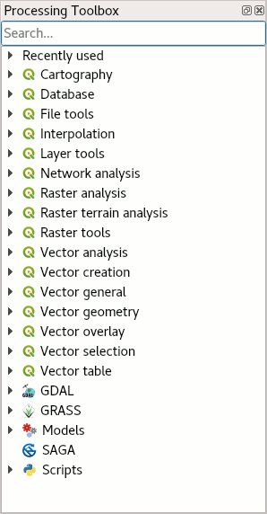
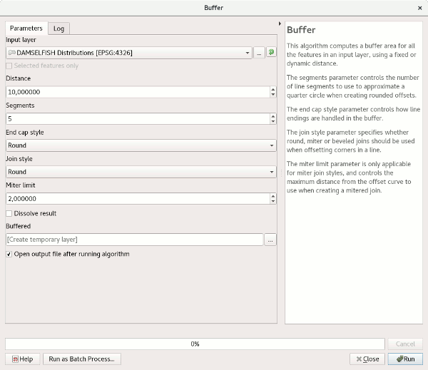
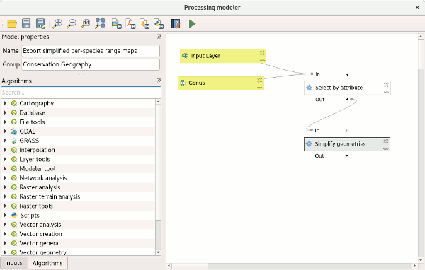

The QGIS Processing Toolbox
===========================

The QGIS Processing Toolbox is a set of geo-spatial algorithms installed with QGIS. Some of them are in fact calling external applications, such as SAGA or GRASS GIS, which is why the algorithms are organised by *provider*.

Type a keyword into the toolbox’ search bar to see what it offers. Searching for “buffer”, for instance, you will notice the different algorithm providers have in fact different implementations of the same algorithm. Often the choice is one of your personal liking, in rare cases the implementations have subtle differences which actually make a difference for your outcomes. E.g. many of the tools from GRASS treat all data as rasters, internally, granted to GRASS’ legacy as one of the earliest GIS systems still in use and the computational limitations at its time of development.

These tools can be run one at a time, or – and that’s where we touch upon our course’s topic – be chained together to form more complex models. On top of that, all the individual algorithms and also the user-defined models can be used in batch-operations, i.e. running the same operation on a (large) number of files and/or with changing parameters.

Let’s see how we can run two operations at once: We want to save a Shapefile with the species ranges of all damselfish of the *Stegates* genus, with simplified geometries. First we select our subset of features, then we simplify the geometries. Let’s use the *Graphical Modeler* of the processing framework. Open it from the *Processing → Graphical Modeler* menu.

- As a first step, add two input parameters to the model, by drag-and-dropping them onto the empty canvas: a *Vector Layer* named ``Input Layer`` and a *String* called ``Genus``.
- Then, add a *Select by attribute* algorithm, and set its input layer to refer to our ``Input Layer`` variable. Enter ``GENUS_NAME`` for the *selection attribute* (that’s the column name in the example dataset which stores the genus information). Select ``=`` as a comparison *operator*, and choose the ``Genus`` variable as comparison *value*.

    .. figure:: img/L7-03-02-select-by-attribute.png

- In the same fashion, add a *Simplify geometries* algorithm. As input, choose the output of the *Select by attribute* algorithm, and specify a name for the output layer (e.g. ``Output Layer``).
- Enter a name and a group for the model (the models and scripts are grouped in categories, which can be chosen according to the user’s need).

Run the model by finding it from the toolbox and specifying an input layer and genus name.

