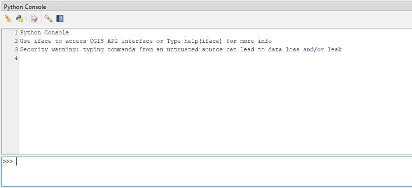
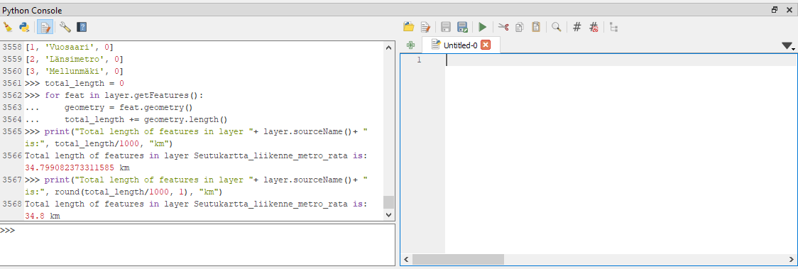
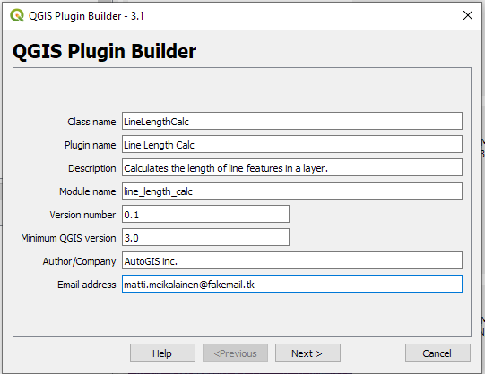
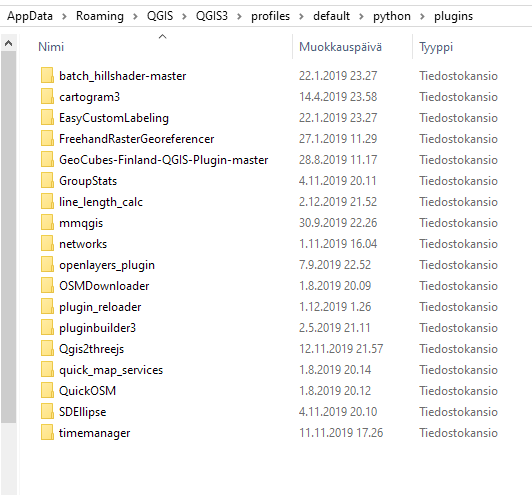
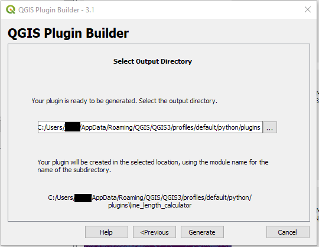
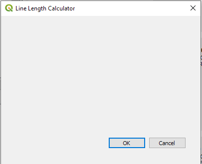
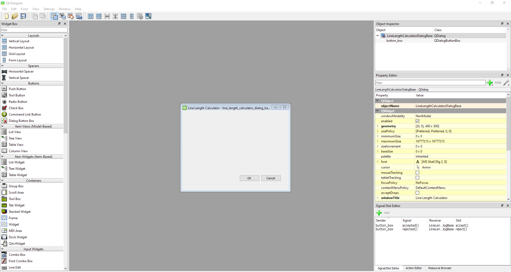
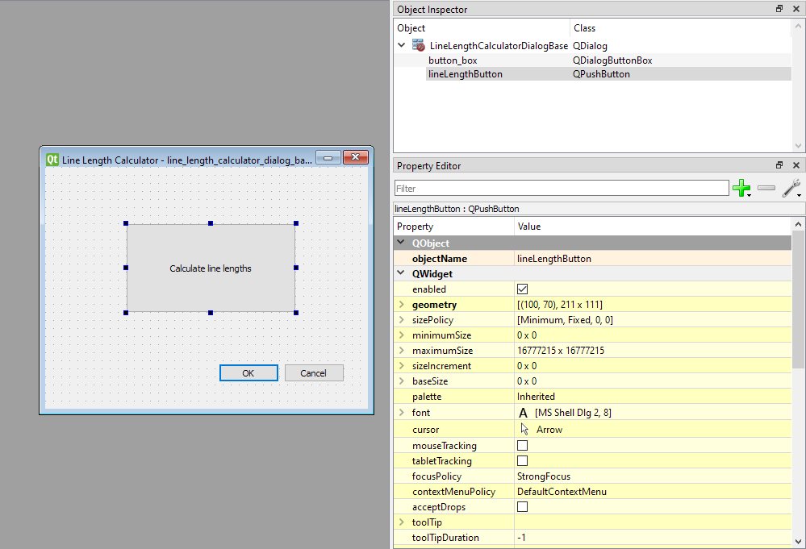
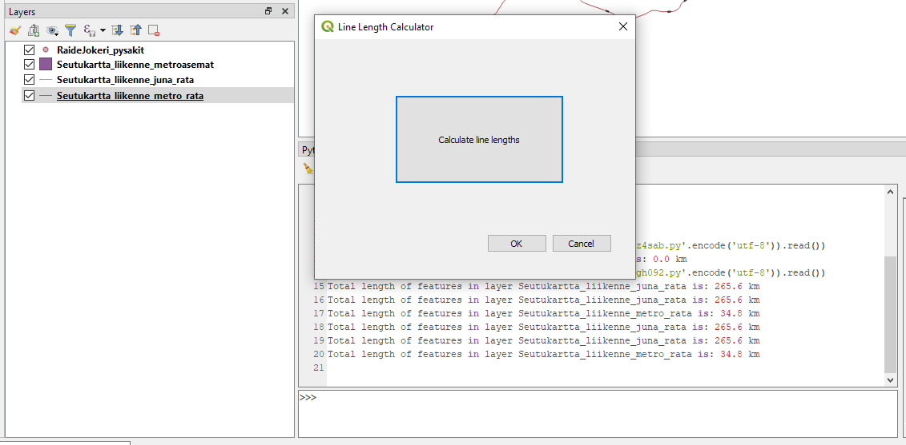

Python in QGIS
--------------

The core application and libraries of QGIS are programmed in C++.
Nevertheless, Python plays an important role in its ecosystem: Most of
the pre-installed plugins and even some of the data provider modules are
written in Python, and virtually all functions of the interface and the
libraries are exported to a Python API (Application Programming
Interface). It takes only moderate effort to author extensions to QGIS
which integrate seamlessly into its user interface, create stand-alone
applications using components of QGIS, such as a map window or a data
backend, or run custom scripts within QGIS. To really dive into using
Python in QGIS, see the `PyQGIS Developer
Cookbook <https://docs.qgis.org/3.4/en/docs/pyqgis_developer_cookbook/intro.html>`__
which walks you from easy Hello World examples to writing your own
applications.

Today, we will concentrate on basic functionalities of Python in QGIS,
or PyQGIS for short. You will learn to run code from the integrated
Python console, then write a simple Python script and finally apply the
script’s functionality to your very own plugin.

Sample data for this tutorial
~~~~~~~~~~~~~~~~~~~~~~~~~~~~~

To get us started, we’ll need some data. Open QGIS and connect to the
City of Helsinki’s WFS service from *Layer > Add layer > Add WFS layer*:

Create a new connection to URL http://kartta.hel.fi/ws/geoserver/avoindata/wfs and load the layer list. Select, for example, the Metro railway lines
(*Seutukartta_liikenne_metro_rata*). **Make sure the coordinate system is set to a projected one**, like ETRS89/GK25FIN (EPSG:3879) before
adding the layer.

Running PyQGIS code in console
~~~~~~~~~~~~~~~~~~~~~~~~~~~~~~

Now that we’re set, let’s open QGIS’s Python console and get to work!
Open it from *Plugins > Python console* or use the shortcut
``Ctrl+Alt+P`` on your keyboard.

   Console

By default an iface object is imported, which allows the access to the
currently active QGIS instance’s user interface. For example, we can
easily retrieve the active (selected) layer, then access its type, name,
and count its features:

.. code:: bash

    # Get active layer:
    >>> layer = iface.activeLayer()
    
    # Let's see what we got
    >>> print(type(layer))
    <class 'qgis._core.QgsVectorLayer'>
    
    >>> print(layer.sourceName())
    Seutukartta_liikenne_metro_rata
    
    >>> print(layer.featureCount())
    3

The layer we got is an object of class *QgsVectorLayer*, which in turn
is within QGIS’s *core* module. There are `seven modules in
total <https://qgis.org/api/modules.html>`__ each housing *classes*
critical for the program.

Above, we call QgsVectorLayer’s methods like
`featureCount()`. You may read more on the methods in the
`documentation <https://qgis.org/pyqgis/3.4/core/QgsVectorLayer.html>`__
or call `help()` on the object for the same information:

.. code:: python

    >>> help(layer)
    Help on QgsVectorLayer in module qgis._core object:
    
    class QgsVectorLayer(QgsMapLayer, QgsExpressionContextGenerator, QgsExpressionContextScopeGenerator, QgsFeatureSink, QgsFeatureSource)
     |  QgsVectorLayer(path: str = '', baseName: str = '', providerLib: str = '', options: QgsVectorLayer.LayerOptions = QgsVectorLayer.LayerOptions())
     |  Constructor - creates a vector layer
     |
        ...

Like the documentation shows, we can use a method to access the features
(=rows on the attribute table) of the layer. Let’s loop through `the
features <https://qgis.org/pyqgis/3.4/core/QgsFeature.html#qgis.core.QgsFeature>`__
and print out attributes from each feature:

.. code:: python

    >>> for feat in layer.getFeatures():
            # attributes() returns a list of attributes assosiated with that feature
            # we'll print the second entries on the lists, which correspond to the 'metrorata' column
    ...     print(feat.attributes()[1])
    Vuosaari
    Länsimetro
    Mellunmäki

If the features are geographical, they’ll have *geometry* as well as
attributes. `The geometry
objects <https://qgis.org/pyqgis/3.0/core/Geometry/QgsGeometry.html>`__
have a method for calculating the length of an feature in map units.
We’ll use this to our advantage and create a simple program for summing
up the total length of line features in the selected layer and print
this out in kilometers:

.. code:: python

    # variable to house the sum of the lengths
    >>> total_length = 0
    
    >>> for feat in layer.getFeatures():
    ...    geometry = feat.geometry()
    ...    total_length += geometry.length()
    
    # printing and transforming the result (rounded to one decimal point) to km
    >>> print("Total length of features in layer "+ layer.sourceName()+ " is:", round(total_length/1000, 1), "km")
    Total length of features in layer Seutukartta_liikenne_metro_rata is: 34.8 km

Creating PyQGIS scripts
~~~~~~~~~~~~~~~~~~~~~~~

Great! But what if we want to show someone our cool function or reuse
the code? Thankfully QGIS also includes a simple code editor, from which
we can run, edit and save Python scripts. Click the middle icon on the
top row of the console and an editor with blank text field should
appear.

   Console and editor

Next, apply the code created previously and make a function. The
function gets the active layer, calculates the length of its features
and then prints the result in the console. Although it’s in poor form to
have so many separate tasks for one function, we do it like this to make
things more straightforward later on.

.. code:: python

    def lineLengthCalc():
        """Sums together the length of features in a line type vector layer, then prints the result in km."""
        # get the current active layer
        layer = iface.activeLayer()
        
        total_length = 0
    
        for feat in layer.getFeatures():
            geometry = feat.geometry()
            total_length += geometry.length()
            
        # print out the result
        print("Total length of features in layer "+ layer.sourceName()+ " is:", round(total_length/1000, 1), "km")
        
    # call the function
    lineLengthCalc()

Run the script to make sure it works. After that, save the result as a
script file *lineLengthCalculator.py*. You may open it anytime from the
code editor.

Next up, we’ll apply the script code to an extremely simple plugin.

Creating QGIS plugins
---------------------

.. admonition:: Note

    The instructions below have been created for Windows
    systems. While all of the instructions can be replicated on other operating systems,
    platform differences do apply.

Plugins extend the functionality of the base installation of QGIS. Written in
Python, they can be shared via the official plugin repository if they
`pass the
requirements <https://docs.qgis.org/testing/en/docs/pyqgis_developer_cookbook/plugins/releasing.html>`__
or be installed from .zip packages. Whatever the method, a `handful of
files <https://docs.qgis.org/testing/en/docs/pyqgis_developer_cookbook/plugins/releasing.html#plugin-structure>`__
is always required. These include the main code *.py* files, files
relating to the user interface and a metadata text file. Creating these
by hand would be tedious and time consuming – thankfully it’s also
needless, since we can get a plugin to do it for us!

Next, open the plugin manager (*Manage and install plugins*) and install
two plugins that’ll help us greatly: **Plugin Builder** and **Plugin Reloader**.
If you can’t find these, make sure Experimental plugins are enabled from
plugin manager settings. *Builder* will create a plugin base in which to
apply the functionality and *Reloader* will greatly help in testing the
plugin.

Creating the plugin base
~~~~~~~~~~~~~~~~~~~~~~~~

Open up *Builder* and start filling the fields as shown below. Since
we’re only creating a toy example, no need to be too serious:

   Plugin builder beginning

You may keep the default settings throughout the wizard until the final
window (*Select output directory*). On this example, we’ll want to
create the plugin directly to where QGIS installs them, in the active
user profile. The path to this folder can be a tricky one, but you’ll
find a shortcut from QGIS’s toolbar: *Settings > User Profiles > Open
active profile folder*. This should open a file navigator in a location
with some folders and other files. Click onwards to one of the folders:
*Python > plugins*. This is QGIS plugin’s default installation folder.
Example location below:

   Folder location

Copy the path to this location and paste it as *Plugin Builder’s* output
directory:

   Plugin builder output

Nice nice! Now just generate the plugin. You may get an error about
compiling resources, but we’ll ignore that for now. Check the *python >
plugins* folder and you ought to find the freshly made plugin.

Initializing
~~~~~~~~~~~~

The plugin’s not quite ready for use yet, we have to make one more
rather tedious thing to make it functional. Open
*line_length_calculator* folder and you’ll find a file called
*resources.qrc*. This file’s required by the ui system (Qt), but we need
to compile it to a *.py* file before the plugin will run (a more
detailed `explanation
here <https://gis-ops.com/qgis-3-qt-designer-explained/#qt-resourcesqrc>`__).
For this purpose, we’ll create something called a *batch file*.

Please note that this approach made for Windows computers. See `Ujaval
Gandhi’s instructions for Mac and
Linux <http://www.qgistutorials.com/en/docs/3/building_a_python_plugin.html>`__.
You’ll need to install something called pb_tool. Windows users might
also find this tool handy if you want to get into serious plugin
development.

Create a new plain text file in the plugin folder and copy the following
commands to that file.

.. admonition:: Note

    Replace the filepath with the path
    to your computer’s installation. At the very least you’ll need to
    replace QGIS 3.X with the version number of your installation, e.g. QGIS
    3.4. The installation could also be somewhere else or in location
    ``"C:\OSGeo4W64..."`` `Read more
    here <http://www.qgistutorials.com/en/docs/3/building_a_python_plugin.html>`__.

.. code:: bash

    @echo off
    call "C:\Program Files\QGIS 3.X\bin\o4w_env.bat"
    call "C:\Program Files\QGIS 3.X\bin\qt5_env.bat"
    call "C:\Program Files\QGIS 3.X\bin\py3_env.bat"
    
    @echo on
    pyrcc5 -o resources.py resources.qrc

Save the text file with the file format marking as *compile.bat*. Then
simply double click to run it. If all goes well, a new *resources* file
should pop up: this time it’s Python code. You plugin folder should look
something like this:

.. figure:: img/plugin_kansio_compilingin_jalkeen.png
   :alt: After compiling the plugin

   After compiling the plugin

Developing the plugin
~~~~~~~~~~~~~~~~~~~~~

Now we can get to business. First restart QGIS and then open the plugin
manager. Our new plugin should be listed in *installed* plugins. Click
it active. A new icon should appear both on the *Plugins* drop-down menu
and on the top toolbar. Run the plugin:

Cool! Too bad it doesn’t do anything yet – all the default buttons do is
close the window. We’ll fix that next.

Go back to your plugin’s folder. Open up the Python file
*line_length_calculator.py* in any code or text editor, for example
IDLE.

This file, automatically created by Plugin Builder, contains all the
necessary elements to quickly get your plugin running. It for example
imports some necessary methods from QGIS’s modules (we didn’t need to do
this when scripting, since most necessary methods are imported
automatically to QGIS’s own Python console). See also how you plugin is
a *class* that includes many methods and that a reference to the
interface is saved at the very beginning as `self.iface`. We’re not
interested in most of the content, however.

Scroll down to the very bottom of the file and you’ll find a method
called *run*. This section of the code is activated any time the user
activates the plugin. Paste the method *lineLengthCalc* from the script
we created earlier below the run method. Make sure it’s correctly
indented!

Now all we need is some handy way for the user to call the method. For
that, we’ll need to do a bit of user interface design.

Adding UI elements
~~~~~~~~~~~~~~~~~~

Like mentioned earlier, the user interface of plugins (and QGIS in
general) is handled by a flexible ui framework called
`Qt <https://pypi.org/project/PyQt5/>`__. We could add elements like
buttons programmatically, but there’s also a handy graphic interface
packaged with most QGIS distributions. **Open Qt Designer with QGIS 3.xx
custom widgets**.

In the *New Form* dialog, select *Open…* and navigate to your plugin’s
folder. From there, you ought to see a *.ui* file called
*line_length_calculator_dialog_base.ui*. Select this. The UI, called
dialog, should look similar to how it looks in QGIS (that is, bland).

   qt_designer beginning

On the left you can see a panel of different ui elements, or widgets.
There are options ranging from lists, sliders and text boxes to QGIS
specific widgets like coordinate extent boxes. On the right you can see
objects inserted in the plugin base and modify their attributes. Nothing
there except for the default *Ok/Cancel* button box.

Time to populate the plugin. Drag a *Push button* to the middle of the
plugin. You may resize it to be more noticiable. Also notice how a
*pushButton* object has been added to the list in *Object inspector*.
Select it and modify a few things in the property editor directly below
it.

-  Change objectName from pushButton to lineLengthButton.

Scroll down and:

-  Change text from PushButton to *Calculate line lengths*. The text in
   the button should change immediately.

The result should look something like below:

   qt_designer end

Aaand we’re done here! **Save the changes** and close Qt Designer.

Linking UI to code
~~~~~~~~~~~~~~~~~~

Our final task in this exercise is to link the method created earlier to
this button so that every time the user clicks on the button, the line
length method is called. All we need is a few additions and
modifications to the code.

UI elements in Qt send something called *signals* when various things
happen to them – they’re for example clicked and so a signal is sent
out. We need to tie this signal to a *slot* that could e.g. be a method
that’s run.

Let’s do just that. Paste the bottommost line of code to *run* method,
below the conditional clause `if self.first_start == True:*`:

.. code:: python

            if self.first_start == True:
                self.first_start = False
                self.dlg = LineLengthCalculatorDialog()
                self.dlg.lineLengthButton.clicked.connect(self.lineLengthCalc)

Transforming that line into plain language, it reads:

::

   In this dialog, every time lineLengthButton is pressed, run the method lineLengthCalc.

The very very final thing is to modify *lineLengthCalc* sligthly. Add a
reference to *self* as the method’s parameter (wanna know why? `Read
this <https://medium.com/quick-code/understanding-self-in-python-a3704319e5f0>`__):

.. code:: python

        def lineLengthCalc(self):

Also add `self` in front of `iface`. Like this:

.. code:: python

            layer = self.iface.activeLayer()

All in all, the bottom of the file should look something like this:

.. code:: python

        def run(self):
            """Run method that performs all the real work"""
    
            # Create the dialog with elements (after translation) and keep reference
            # Only create GUI ONCE in callback, so that it will only load when the plugin is started
            if self.first_start == True:
                self.first_start = False
                self.dlg = LineLengthCalculatorDialog()
                self.dlg.lineLengthButton.clicked.connect(self.lineLengthCalc)
    
            # show the dialog
            self.dlg.show()
            # Run the dialog event loop
            result = self.dlg.exec_()
            # See if OK was pressed
            if result:
                # Do something useful here - delete the line containing pass and
                # substitute with your code.
                pass
    
        def lineLengthCalc(self):
            """Sums together the length of features in a line type vector layer, then prints the result in km."""
            # get the current active layer
            layer = self.iface.activeLayer()
        
            total_length = 0
    
            for feat in layer.getFeatures():
                geometry = feat.geometry()
                total_length += geometry.length()
            
            # print out the result
            print("Total length of features in layer "+ layer.sourceName()+ " is:",
                  round(total_length/1000, 1), "km")

Gongrats, you’ve created your very first QGIS plugin! Time to enjoy the
fruits of your labor.

**Save line_length_calculator.py**. Then return to QGIS and reload your
plugin with *Plugin reloader* for the changes to take effect
(alternatively restart the whole program).

The plugin should look something like this and function identically to
the script made above.

.. admonition:: Task

    There are many ways to expand this simple plugin. Can you, for example, think of a way to
    check that the layer object is not empty (which results in an error)? Or let user select the layer from a
    drop-down box instead of using the active layer?
    (`Hint <https://gis.stackexchange.com/questions/118862/getting-list-of-layer-names-using-pyqgis>`__)

Additional resources
~~~~~~~~~~~~~~~~~~~~

You’ve been very briefly introduced to PyQGIS and Python plugin
development. If the subject interests you, we strongly recommend
checking out these more extensive tutorials and resources:

Python in QGIS
^^^^^^^^^^^^^^

-  Anita Graser’s beginner-friendly `PyQGIS 101: Introduction to QGIS
   Python programming for
   non-programmers <https://anitagraser.com/pyqgis-101-introduction-to-qgis-python-programming-for-non-programmers/>`__

-  `PyQGIS Developer
   Cookbook <https://docs.qgis.org/testing/en/docs/pyqgis_developer_cookbook/>`__
   with compehensive tutorials.

-  Gary Sherman’s book (available for purchase) `The PyQGIS Programmer’s
   Guide <http://locatepress.com/ppg3>`__

-  `StackExchange GIS <https://gis.stackexchange.com/>`__

-  Reading the source code of installed plugins for further ideas

Getting started with plugin development
^^^^^^^^^^^^^^^^^^^^^^^^^^^^^^^^^^^^^^^

-  `QGIS 3 plugin development
   guide <https://gis-ops.com/qgis-3-plugin-development-reference-guide/>`__
   by Nils Nolde

-  `Building a Python Plugin
   (QGIS3) <http://www.qgistutorials.com/en/docs/3/building_a_python_plugin.html>`__
   by Ujaval Gandhi
